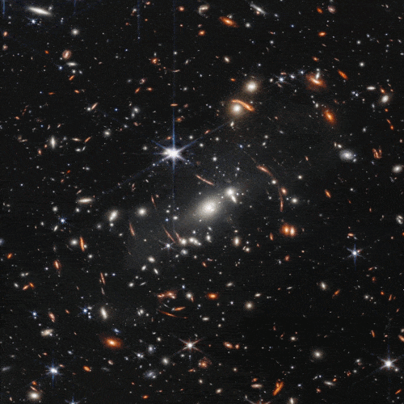

# JWST Diffraction Spikes Fix (PoC) ✨
This repository contains a deep learning model to remove diffraction spikes from JWST images.  
JWST images show diffraction spikes due to how starlight is captured by the satellite.  
The information hidden by these diffraction spikes can't be recovered.  
However, for aesthetic purposes, I have tried to reduce these spikes with a DL algorithm.  
This model was conceived as a Proof of Concept to see if this idea could work.  
Better results can be achieved with more time and resources.  

## Steps to build this project (4 days)
1) Evaluate feasability and needs
2) Download JWST Images
3) Build the required dataset from scratch
4) Build the model
5) Train / optimize (optimizer, hyperparameters, perceptual loss, etc.)
6) Evaluate results
7) Release (demo / github)

## Results
Overall the model seems to work on most images. It still leaves some post-processing artifacts.  
The dataset may underepresent nebulae and very large diffraction spikes, leading in less accurate results in these conditions.

##
⭐ If you like this repo, thanks! 🙏
